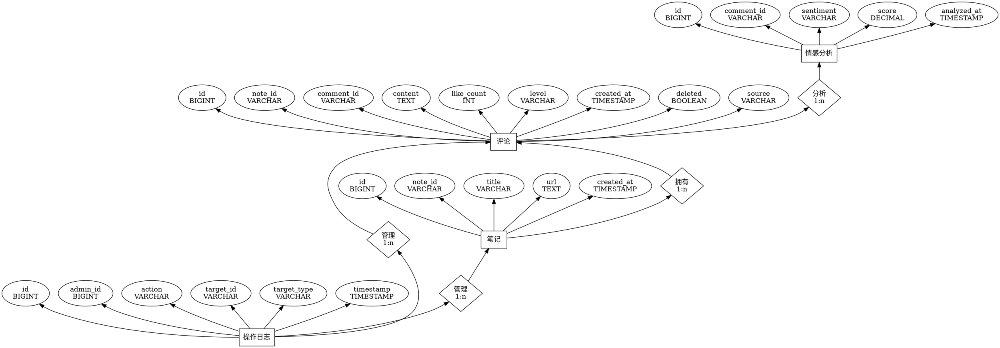

以下是将您的详细设计报告和数据库设计文档整合后的版本，删除了“用户”模块（包括用户管理、用户相关的表结构和关系），并更新了相关部分。整合后，系统将聚焦于话题管理、评论管理、评论分析和评论爬取模块，同时使用技术选型（Vite + Element Plus 前端，Spring Boot + Maven + MyBatis 后端，Python 实现的评论爬取）。

---

# 详细设计报告

## 1. 概述
本详细设计细化实现细节，覆盖新增话题、查看评论、删除评论、评论分析和评论爬取功能。本文档包括模块分解、数据结构、接口定义、算法逻辑和错误处理机制，为开发人员提供清晰的实现蓝图。

## 2. 系统架构
系统采用客户端-服务器架构，使用 RESTful API 作为后端接口，数据存储在关系型数据库（MySQL）中。前端为基于 Vite 和 Element Plus 构建的 Web 应用，通过 HTTP 请求与后端交互。后端使用 Spring Boot 框架，结合 Maven 管理依赖，MyBatis 作为 ORM 工具。新增的评论爬取模块使用 Python 实现，独立运行并通过 API 与主系统交互。主要模块包括：
- **话题管理（新增话题）**：管理话题的创建。
- **评论管理（查看评论、删除评论）**：支持评论的查看和删除。
- **评论分析**：分析评论的情感或趋势。
- **评论爬取**：从小红书等平台爬取评论并存储。

## 3. 模块设计

### 3.1 话题管理（新增话题）
#### 功能
- 创建新话题，存储话题信息。
- 输入：话题标题（topicName）。
- 输出：话题 ID 及创建状态。

#### 数据结构
- **话题表（notes）**（数据库）：
  ```sql
  CREATE TABLE `notes` (
      `id` BIGINT NOT NULL AUTO_INCREMENT,
      `note_id` VARCHAR(64) NOT NULL,                -- 话题唯一标识符
      `title` VARCHAR(255) NOT NULL,                  -- 话题标题
      `url` TEXT NOT NULL,                            -- 话题链接
      `created_at` TIMESTAMP DEFAULT CURRENT_TIMESTAMP,  -- 创建时间
      PRIMARY KEY (`id`),
      UNIQUE INDEX `note_id` (`note_id`)
  ) ENGINE = InnoDB DEFAULT CHARSET = utf8mb4 COLLATE = utf8mb4_0900_ai_ci;
  ```

#### 接口
- **POST /api/topics**
  - **请求**：
    ```json
    {
      "topicName": "string"
    }
    ```
  - **响应**（201 Created）：
    ```json
    {
      "id": "number",
      "topicName": "string",
      "createdAt": "timestamp"
    }
    ```
  - **错误响应**：
    - 400 Bad Request：缺少或无效字段。

#### 逻辑（伪代码）
基于活动图“新增话题”：
```plaintext
函数 CreateTopic(topicName):
    如果 topicName 为空:
        返回 错误(400, "话题标题必填")
    topicId = 数据库.插入话题(topicName, url="", createdAt=当前时间)
    返回 { id: topicId, topicName, createdAt }
```
![[Pasted image 20250430084818.png]]

### 3.2 评论管理（查看评论）
#### 功能
- 查看某话题的所有评论。
- 输入：话题 ID（topicId）。
- 输出：评论列表。

#### 数据结构
- **评论表（note_comments）**（数据库）：
  ```sql
  CREATE TABLE `note_comments` (
      `id` BIGINT NOT NULL AUTO_INCREMENT,
      `note_id` VARCHAR(64) NOT NULL,                -- 话题ID，外键
      `comment_id` VARCHAR(64) NOT NULL,             -- 评论ID
      `content` TEXT NOT NULL,                       -- 评论内容
      `like_count` INT DEFAULT 0,                    -- 点赞数
      `level` VARCHAR(8) DEFAULT NULL,               -- 评论等级（如普通、VIP等）
      `created_at` TIMESTAMP DEFAULT CURRENT_TIMESTAMP,  -- 评论创建时间
      `deleted` BOOLEAN DEFAULT FALSE,               -- 是否删除
      `source` VARCHAR(50) DEFAULT 'local',          -- 评论来源（如 local 或 crawled）
      PRIMARY KEY (`id`),
      UNIQUE KEY `uniq_comment_id` (`comment_id`),
      INDEX `note_id` (`note_id`),
      CONSTRAINT `note_comments_ibfk_1` FOREIGN KEY (`note_id`) REFERENCES `notes` (`note_id`) ON DELETE CASCADE
  ) ENGINE = InnoDB DEFAULT CHARSET = utf8mb4 COLLATE = utf8mb4_0900_ai_ci;
  ```

#### 接口
- **GET /api/topics/{topicId}/comments**
  - **响应**（200 OK）：
    ```json
    [
      {
        "id": "number",
        "topicId": "string",
        "content": "string",
        "like_count": "number",
        "level": "string",
        "created_at": "timestamp",
        "deleted": "boolean",
        "source": "string"
      }
    ]
    ```
  - **错误响应**：
    - 404 Not Found：话题不存在。

#### 逻辑（伪代码）
基于活动图“查看评论”：
```plaintext
函数 GetComments(topicId):
    如果 !数据库.话题存在(topicId):
        返回 错误(404, "话题不存在")
    comments = 数据库.查找评论(topicId, deleted=false)
    返回 comments
```
![[Pasted image 20250430084929.png]]

### 3.3 评论管理（删除评论）
#### 功能
- 删除某条评论（逻辑删除，标记为已删除）。
- 输入：评论 ID（id）。
- 输出：删除状态。

#### 数据结构
- 使用上述评论表（note_comments），通过 `deleted` 字段标记删除状态。

#### 接口
- **DELETE /api/comments/{id}**
  - **响应**（204 No Content）：评论已删除。
  - **错误响应**：
    - 404 Not Found：评论不存在。

#### 逻辑（伪代码）
基于活动图“删除评论”：
```plaintext
函数 DeleteComment(commentId):
    comment = 数据库.查找评论(commentId)
    如果 comment 为空:
        返回 错误(404, "评论不存在")
    如果 comment.deleted == true:
        返回 错误(400, "评论已删除")
    数据库.更新评论(commentId, deleted=true)
    返回 成功(204)
```
![[Pasted image 20250430084857.png]]

### 3.4 评论分析
#### 功能
- 分析某话题的评论，统计情感分布。
- 输入：话题 ID（topicId）。
- 输出：情感分析结果（正面/负面/中立评论计数）。

#### 数据结构
- 内存中的分析结果结构：
  ```json
  {
    "topicId": "string",
    "totalComments": "number",
    "sentiment": {
      "positive": "number",
      "negative": "number",
      "neutral": "number"
    }
  }
  ```

#### 接口
- **GET /api/topics/{topicId}/analysis**
  - **响应**（200 OK）：
    ```json
    {
      "topicId": "string",
      "totalComments": "number",
      "sentiment": {
        "positive": "number",
        "negative": "number",
        "neutral": "number"
      }
    }
    ```
  - **错误响应**：
    - 404 Not Found：话题不存在。

#### 逻辑（伪代码）
基于活动图“评论分析”：
```plaintext
函数 AnalyzeComments(topicId):
    如果 !数据库.话题存在(topicId):
        返回 错误(404, "话题不存在")
    comments = 数据库.查找评论(topicId, deleted=false)
    totalComments = comments.长度
    sentiment = { positive: 0, negative: 0, neutral: 0 }
    对每个 comment 在 comments 中:
        sentimentResult = 情感分析(comment.content)
        sentiment[sentimentResult] += 1
    返回 { topicId, totalComments, sentiment }
```
![[Pasted image 20250430085013.png]]

### 3.5 评论爬取模块
#### 功能
- 从外部平台（如小红书）爬取评论，并存储到系统中。
- 输入：话题 ID（topicId）、爬取目标 URL。
- 输出：爬取状态及存储的评论数量。

#### 数据结构
- 使用上述评论表（note_comments），通过 `source` 字段标记评论来源（如 `source='crawled'`）。

#### 接口
- **POST /api/crawl/comments**
  - **请求**：
    ```json
    {
      "topicId": "string",
      "url": "string"
    }
    ```
  - **响应**（200 OK）：
    ```json
    {
      "status": "success",
      "crawledCount": "number"
    }
    ```
  - **错误响应**：
    - 400 Bad Request：缺少必填字段或 URL 无效。
    - 500 Internal Server Error：爬取失败。

#### 逻辑（伪代码）
基于活动图“评论爬取”：
```plaintext
函数 CrawlComments(topicId, url):
    如果 topicId 为空 或 url 为空:
        返回 错误(400, "话题ID和URL必填")
    如果 !数据库.话题存在(topicId):
        返回 错误(404, "话题不存在")
    comments = Python爬取脚本(url)
    crawledCount = 0
    对每个 comment 在 comments 中:
        如果 comment.content 有效:
            数据库.插入评论(topicId, comment.content, source="crawled")
            crawledCount += 1
    返回 { status: "success", crawledCount }
```
![[Pasted image 20250430085045.png]]

#### 实现细节
- 使用 Python 编写爬取脚本（`crawl_comments.py`），依赖 `requests` 和 `BeautifulSoup` 库。
- 爬取逻辑：
  - 发送 HTTP 请求到目标 URL，使用伪装 User-Agent 避免反爬。
  - 解析 HTML，提取评论内容。
  - 通过 Spring Boot REST 接口将爬取结果提交到后端。
- 存储优化：使用批量插入减少数据库操作开销。

## 4. 数据库设计

### 4.1 概述
本系统的数据库设计围绕评论管理和情感分析展开，主要包含以下表：
- **notes**：存储话题信息。
- **note_comments**：存储每个话题下的评论。
- **comment_sentiment_analysis**：存储评论的情感分析结果。
- **operation_logs**：记录管理员操作日志。

### 4.2 数据库表设计

#### 4.2.1 `notes` 表（话题表）
用于存储系统中所有话题的信息。
```sql
CREATE TABLE `notes` (
    `id` BIGINT NOT NULL AUTO_INCREMENT,
    `note_id` VARCHAR(64) NOT NULL,                -- 话题唯一标识符
    `title` VARCHAR(255) NOT NULL,                  -- 话题标题
    `url` TEXT NOT NULL,                            -- 话题链接
    `created_at` TIMESTAMP DEFAULT CURRENT_TIMESTAMP,  -- 创建时间
    PRIMARY KEY (`id`),
    UNIQUE INDEX `note_id` (`note_id`)
) ENGINE = InnoDB DEFAULT CHARSET = utf8mb4 COLLATE = utf8mb4_0900_ai_ci;
```

**字段说明**：
|字段名|类型|描述|
|---|---|---|
|`id`|BIGINT|自增主键|
|`note_id`|VARCHAR(64)|话题的唯一标识符|
|`title`|VARCHAR(255)|话题标题|
|`url`|TEXT|话题的URL链接|
|`created_at`|TIMESTAMP|话题创建时间|

#### 4.2.2 `note_comments` 表（评论表）
用于存储每个话题下的评论信息。
```sql
CREATE TABLE `note_comments` (
    `id` BIGINT NOT NULL AUTO_INCREMENT,
    `note_id` VARCHAR(64) NOT NULL,                -- 话题ID，外键
    `comment_id` VARCHAR(64) NOT NULL,             -- 评论ID
    `content` TEXT NOT NULL,                       -- 评论内容
    `like_count` INT DEFAULT 0,                    -- 点赞数
    `level` VARCHAR(8) DEFAULT NULL,               -- 评论等级（如普通、VIP等）
    `created_at` TIMESTAMP DEFAULT CURRENT_TIMESTAMP,  -- 评论创建时间
    `deleted` BOOLEAN DEFAULT FALSE,               -- 是否删除
    `source` VARCHAR(50) DEFAULT 'local',          -- 评论来源（如 local 或 crawled）
    PRIMARY KEY (`id`),
    UNIQUE KEY `uniq_comment_id` (`comment_id`),
    INDEX `note_id` (`note_id`),
    CONSTRAINT `note_comments_ibfk_1` FOREIGN KEY (`note_id`) REFERENCES `notes` (`note_id`) ON DELETE CASCADE
) ENGINE = InnoDB DEFAULT CHARSET = utf8mb4 COLLATE = utf8mb4_0900_ai_ci;
```

**字段说明**：
|字段名|类型|描述|
|---|---|---|
|`id`|BIGINT|自增主键|
|`note_id`|VARCHAR(64)|话题ID，关联 `notes` 表|
|`comment_id`|VARCHAR(64)|评论ID，唯一标识每个评论|
|`content`|TEXT|评论内容|
|`like_count`|INT|点赞数|
|`level`|VARCHAR(8)|评论等级（如普通、VIP等）|
|`created_at`|TIMESTAMP|评论创建时间|
|`deleted`|BOOLEAN|是否删除|
|`source`|VARCHAR(50)|评论来源（如 local 或 crawled）|

#### 4.2.3 `comment_sentiment_analysis` 表（评论情感分析表）
用于存储对每条评论的情感分析结果。
```sql
CREATE TABLE `comment_sentiment_analysis` (
    `id` BIGINT NOT NULL AUTO_INCREMENT,
    `comment_id` VARCHAR(64) NOT NULL,              -- 外键：评论ID
    `sentiment` VARCHAR(16) NOT NULL,               -- 情感类别：positive / negative / neutral
    `score` DECIMAL(5,4) NOT NULL,                  -- 情感得分：如0.8421（置信度）
    `analyzed_at` TIMESTAMP DEFAULT CURRENT_TIMESTAMP,  -- 分析时间
    PRIMARY KEY (`id`),
    UNIQUE KEY `uniq_comment_id` (`comment_id`),
    CONSTRAINT `fk_comment_sentiment` FOREIGN KEY (`comment_id`) REFERENCES `note_comments` (`comment_id`) ON DELETE CASCADE
) ENGINE = InnoDB DEFAULT CHARSET = utf8mb4 COLLATE = utf8mb4_0900_ai_ci;
```

**字段说明**：
|字段名|类型|描述|
|---|---|---|
|`id`|BIGINT|自增主键|
|`comment_id`|VARCHAR(64)|关联 `note_comments.comment_id`|
|`sentiment`|VARCHAR(16)|情感类别（positive / negative / neutral）|
|`score`|DECIMAL(5,4)|情感得分|
|`analyzed_at`|TIMESTAMP|情感分析时间|

#### 4.2.4 `operation_logs` 表（管理员操作日志表）
记录管理员在后台进行的操作。
```sql
CREATE TABLE `operation_logs` (
    `id` BIGINT NOT NULL AUTO_INCREMENT,
    `admin_id` BIGINT NOT NULL,                     -- 管理员ID
    `action` VARCHAR(255) NOT NULL,                 -- 动作描述（如删除评论、添加话题等）
    `target_id` VARCHAR(64) DEFAULT NULL,           -- 操作目标ID（如评论ID或话题ID）
    `target_type` VARCHAR(32) DEFAULT NULL,         -- 操作目标类型（如 comment 或 note）
    `timestamp` TIMESTAMP DEFAULT CURRENT_TIMESTAMP,  -- 操作时间
    PRIMARY KEY (`id`)
) ENGINE = InnoDB DEFAULT CHARSET = utf8mb4;
```

**字段说明**：
|字段名|类型|描述|
|---|---|---|
|`id`|BIGINT|自增主键|
|`admin_id`|BIGINT|管理员ID|
|`action`|VARCHAR(255)|管理员执行的操作（如删除评论等）|
|`target_id`|VARCHAR(64)|操作的目标ID（如评论ID、话题ID）|
|`target_type`|VARCHAR(32)|操作的目标类型（如 `comment` 或 `note`）|
|`timestamp`|TIMESTAMP|操作的时间|

### 4.3 数据库关系
- **`note_comments`** 表通过 `note_id` 字段关联 **`notes`** 表，表示评论属于某个话题。
- **`comment_sentiment_analysis`** 表通过 `comment_id` 外键关联 **`note_comments`** 表，用于存储评论的情感分析结果。
- **`operation_logs`** 表记录管理员的操作日志，关联 `admin_id` 和 `target_id`。

### 4.4 ER 图
以下是基于 Graphviz 的 ER 图代码，适合在 Obsidian 中渲染：


#### 渲染建议
- 在 Obsidian 中启用 **Obsidian Graphviz** 插件的 **d3-graphviz** 模式（设置 > 插件选项 > Use d3-graphviz），以生成可缩放的 SVG 图表。

## 5. 错误处理
- **客户端错误**：
  - 400 Bad Request：输入无效或缺失。
  - 404 Not Found：资源（话题/评论）不存在。
- **服务器错误**：
  - 500 Internal Server Error：记录错误详情，返回通用错误信息。
- **日志**：所有错误记录包括时间戳、请求详情和堆栈跟踪。

## 6. 性能优化
- **数据库索引**：
  - 在 `notes` 表的 `note_id` 字段上创建索引，加速查询。
  - 在 `note_comments` 表的 `note_id` 字段上创建索引，优化评论检索。
- **分页**：
  - 评论查询支持分页（例如，`limit` 和 `offset` 查询参数）。
- **爬取优化**：
  - 限制爬取频率，避免触发目标网站的反爬机制。
  - 使用异步任务（如 Celery）处理爬取任务，避免阻塞主线程。

## 7. 安全性
- **输入验证**：对所有输入进行消毒，防止 SQL 注入和 XSS 攻击。
- **限流**：对 API 请求设置限流，防止滥用。
- **爬取安全**：
  - 验证爬取 URL，避免非法请求。
  - 使用伪装 User-Agent，降低被目标网站封禁的风险。

## 8. 技术选型
- **前端**：Vite + Element Plus + TypeScript（Vue.js 框架，用于快速构建交互式界面）。
- **后端**：Spring Boot + Maven + MyBatis（Java 框架，依赖管理和 ORM 工具）。
- **数据库**：MySQL。
- **评论爬取**：Python（使用 `requests` 和 `BeautifulSoup` 库）。
- **情感分析**：待定（建议使用 Python 的 VADER 或类似工具，需进一步设计）。

## 9. 假设
- 系统使用关系型数据库（MySQL）。
- 情感分析和评论爬取依赖现有第三方库。
- 前端基于 Vite 和 Element Plus + TypeScript，使用 Vue.js 构建。
- 后端使用 Spring Boot，通过 MyBatis 操作数据库。
- 所有 API 均为 RESTful，返回 JSON 格式。

### 说明
- **新增模块**：
  - **评论爬取模块**：实现了从外部平台（如小红书）爬取评论的功能，使用 Python 脚本（`crawl_comments.py`）完成爬取，并通过 Spring Boot 后端接口调用脚本。爬取结果存储到 `note_comments` 表中
- **技术选型更新**：
  - 前端明确为 **Vite + Element Plus + TypeScript**。
  - 后端明确为 **Spring Boot + Maven + MyBatis**。