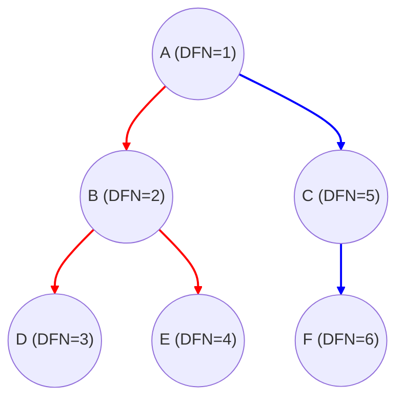

```mermaid
graph TD
    A(("A (DFN=1)")) --> B(("B (DFN=2)"))
    A --> C(("C (DFN=5)"))
    B --> D(("D (DFN=3)"))
    B --> E(("E (DFN=4)"))
    C --> F(("F (DFN=6)"))

    %% 标注遍历路径
    linkStyle 0 stroke:#ff0000,stroke-width:2px;
    linkStyle 1 stroke:#0000ff,stroke-width:2px;
    linkStyle 2 stroke:#ff0000,stroke-width:2px;
    linkStyle 3 stroke:#ff0000,stroke-width:2px;
    linkStyle 4 stroke:#0000ff,stroke-width:2px;
```
